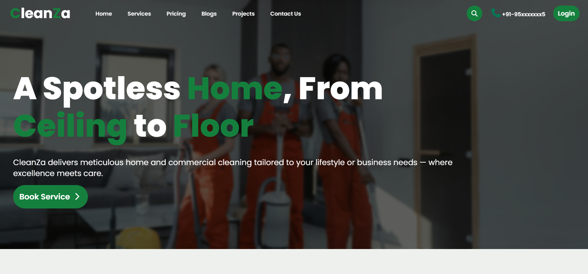

# Cleanza – Cleaning Service Website


**Cleanza** is a *Django-based web application* that I built to understand how real-world **service booking systems** work. The main idea of this project is to allow users to view cleaning services and book them online.



## About the Project
This project was created as part of my learning in **Django**.  
It focuses on core features like **user authentication, service listing, and booking management**.

Through this project, I practiced:
- Working with **models, views, templates**
- Handling **forms and user input**
- Writing blogs with **Quill JS Editor**
- Connecting **frontend with backend**


## Features

### Authentication & User Management
- User registration and login  
- Email verification system  
- Profile management (My Account section) 
### Services & Booking
- Browse available cleaning services  
- Book cleaning services  
- View booking history  
- Reschedule or cancel bookings  
- Write reviews after service completion

### User Dashboard
- Personalized dashboard  
- View and manage all bookings  
- Track booking status 

### Blog System
- Only verified users can write blogs  
- Users can view their own blogs  
- Public blog page to explore other users' blogs 

### Other Features
- Daily updated on Community support
- Gives Helps 
- Contact form

---

## Tech Support

| Category   | Technologies                                                                 |
|------------|------------------------------------------------------------------------------|
| Frontend   | HTML, CSS, TailwindCSS, Bootstrap                                            |
| Scripts    | JavaScript, jQuery                                                           |
| Libraries  | Swiper.js, Quill.js                                                          |
| Backend    | Python, Django                                                               |
| Database   | SQLite                                                                       |
| Tools      | Git, GitHub                                                                  |

## Project Structure
***Cleanza/***
- manage.py  
- db.sqlite3  
- requirements.txt  
- Cleanza/ (Project settings and configuration)  
- RajApp/ (Main application)  
- static/ (Static files)


## Future Improvements
- Admin Panel
- Payment integration  
- Notifications (SMS)  
- Improved UI/UX  
- Deployment 

## Installation
#### 1. Clone the repository:
```bash
git clone https://github.com/iamraj333/Cleanza-Cleaning-Service-Provider-Platform-Django-.git
```
#### 2. Create Virtual Environment
```bash
python -m venv venv
source venv/bin/activate
```
#### 3. Install Project Dependecies
```bash
pip install -r requirements.txt
```
#### 4. Run Migration Command
```bash
python manage.py migrate
```
#### 5. Start Django Server
```bash
python manage.py runserver
```
#### 6. Open Browser
```bash
http://127.0.0.1:8000/
```
#### 7. Create Superuser
```bash
python manage.py createsuperuser
```
#### 8. Access Admin Panel
```bash
http://127.0.0.1:8000/admin/
```
---
#### 9. Add Email Host & Password in Settings.py
```bash
EMAIL_HOST_USER='Your email'
EMAIL_HOST_PASSWORD='Your Password'
```
---
#### 10. Add Secret Key in Settings.py
```bash
SECRET_KEY='Your Secret Key'
```
---

## Author
Developed By **[Rajkumar Gupta](https://github.com/iamraj333)**


